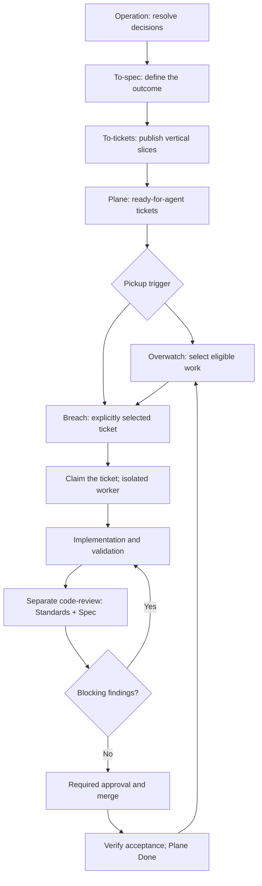

# From planning to delivery: Pocock + XO

The planning skills stay in place: `/operation` → `/to-spec` → `/to-tickets`.
`/operation` is this repository's rename of Pocock's wayfinder, bundled with attribution; its map resolves decisions until the route is clear, and the resulting implementation tickets are what Overwatch and Breach deliver.
XO takes over delivery through `/overwatch` and `/breach`, then coordinates a separate `/code-review`, corrections, merge and Plane completion.
The upstream command names are singular: `/to-spec` and `/to-tickets`.
These are useful stages, not mandatory ceremony for every small ticket.

## The flow

The return to Overwatch happens only while its scoped pickup policy remains enabled and has capacity and budget.
An empty queue is a valid outcome.

## What stays and what changes

| Stage | Owner | What changes |
| --- | --- | --- |
| `/operation` | XO with the captain | Pocock's wayfinder, renamed and bundled; keep its decision-map workflow and tracker conventions. |
| `/to-spec` | Planning session | Keep synthesis, agreed testing seams and publication to the configured tracker. |
| `/to-tickets` | Planning session | Keep approved vertical slices, native blockers and the `ready-for-agent` label. |
| `/overwatch` | XO | New optional automatic intake policy; selects eligible implementation tickets within an agreed scope. |
| `/breach <ticket>` | XO and a worker | Adapted implementation entrypoint; claimed ticket, isolated worktree, engineering practices and supervised delivery. |
| `/code-review` | Fresh reviewer context or the configured review pipeline | Keep Pocock's Standards and Spec axes; supply the claimed ticket and exact commit range explicitly. |
| Corrections | Original worker | Update the same implementation branch and PR; refresh review evidence after changes. |
| Merge | Authorized identity or configured merge process | Existing branch protection, required checks and approval rules still apply. |
| Done | XO through the session connector | Verify merged PR and acceptance criteria before completing the implementation ticket. |

Planning can happen in a project session or through a planning worker routed by XO.
Keeping those skills unchanged does not mean running their project edits directly in the supervisor's own checkout.
The session's Plane connector and the home's tracker binding remain essential; [`docs/tracker-binding.md`](tracker-binding.md) owns both.

## Readiness is a label, not a status

Your Platform project already has the `ready-for-agent` label.
Its description means the work is specified well enough for an agent to execute without further clarification.
Plane states continue to represent progress: Backlog/Todo → In Progress → In Review → Done.
Claimed work that becomes blocked is reconciled explicitly and stays in the implementing state until a deliberate hand-back or handoff; the Blocked state itself is outside that progression, and [`docs/tracker-binding.md`](tracker-binding.md) records its role.

Both upstream `/to-spec` and `/to-tickets` apply the readiness label.
Therefore automatic pickup must distinguish a parent specification from its implementation slices.
The normal automatic queue contains implementation tickets from the approved breakdown, not the parent spec, operation map, research question or decision ticket.
A label alone is insufficient authorization to implement an entire parent feature.

For each candidate, XO checks its role, acceptance criteria, parent/child relationships, native blocking dependencies and package/interface overlap.
The claim boundary [`docs/tracker-binding.md`](tracker-binding.md) fixes is checked against the connector's live reads immediately before claiming.
Parent/spec classification and cross-ticket overlap assessment are agent responsibilities too; nothing here enforces them mechanically.
When classification is unclear, XO holds that ticket for clarification instead of assuming it is a build task.

Do not automatically close the parent specification or operation map when one implementation ticket finishes.
Their completion follows the planning workflow and aggregate acceptance criteria.

## Two ways to start implementation

| Command | Meaning |
| --- | --- |
| `/breach PLAT-27` | Implement this selected ticket once, through a worker. |
| `/overwatch on` | Enable bounded automatic pickup for this home's configured Plane project. |
| `/overwatch status` | Show the active scope, limits and claimed work. |
| `/overwatch off` | Stop taking new tickets; preserve active implementations and PR supervision. |

In Codex, use `$breach` and `$overwatch`; slash-style commands apply to harnesses that expose skills that way.
There is no new coordinator `/implement` alias to collide with the upstream skill.

Overwatch calls Breach with a selected ticket; it does not perform implementation itself.
Breach can also be invoked directly without enabling Overwatch.
The planning skills remain project-owned, while these two orchestration skills live in the XO fork.

## How automatic pickup works

Overwatch is disabled until explicitly enabled for a configured scope.
The initial defaults are two open executions, a five-minute check interval and ten successful claims per activation; these bounds can be changed when enabling.
Open executions include held work and PRs awaiting review, so implementation does not produce an unlimited review backlog.

XO's watcher can suppress unchanged heartbeats.
Overwatch therefore registers a lightweight custom check through the existing hash-validated check mechanism.
The check emits a pickup-due event; XO reads Plane through its session connector and reasons about selection when woken.
The helper itself reads no ticket, claims none and starts no worker: it holds local policy only.

A live supported XO agent and its single existing supervision cycle are required, even while the execution queue is empty.
A registered timer is not proof that a supervisor is running.
Wake timing follows the watcher's check cadence, so the configured interval is a minimum rather than an exact schedule.

On a due wake, XO first reconciles its existing claims, workers and PRs.
If capacity exists, it reads the queue, works the set of tickets whose blockers have completed, and selects by priority with deterministic tie-breaking.
It claims one candidate at a time, by moving that ticket to the implementing state, and dispatches only after that move is confirmed.
An empty queue backs off polling to at most one hour and produces no routine chat noise.

A changed tracker binding, an ambiguous claim outcome, an access failure or an unresolved authorization question pauses new intake.
Reaching the pickup budget stops further intake until deliberately re-enabled.
Stopping pickup does not hand tickets back, cancel workers or merge PRs.

The capacity and classification decisions are performed by the skill; duplicate pickup is excluded by the ticket's own state, because a ticket that has left its pickup state is no longer eligible.
The timer's local counter is a pickup limit, not a model-token billing limit.

## Multiple people and parallel workers

Every person may run their own XO instance and choose their own queue scope.
The human assignee on a Plane ticket remains unchanged when an agent claims execution.
All participating instances must work the same canonical Plane workspace and project for the same tickets.

Two instances may see the same labelled ticket, but the first one to move it out of its pickup state has it.
The other instance re-reads the ticket before dispatching, finds it already implementing, and skips or reconciles it rather than starting duplicate implementation.
That window is narrow rather than absent, so a claim is always immediately preceded by a fresh read.
A claimed ticket stays claimed during review and does not expire merely because a worker becomes idle.

Different tickets may run in parallel in isolated worktrees when their interfaces and dependencies permit it.
Isolation does not prevent semantic conflicts in schemas, APIs, root configuration or shared packages.
XO must coordinate those boundaries, and validation must cover affected consumers.
A monorepo's existing delivery pipeline remains responsible for integrating against the current target branch.

## Implementation with Breach

Breach is an attributed adaptation of Matt Pocock's small `implement` skill, not a fork of the whole skills collection.
It preserves the engineering sequence: implement agreed scope, use TDD where appropriate, run typechecking and focused tests, validate the completed change, then review.

The main differences are ownership and context.
XO receives the ticket, claims it, creates the task brief and dispatches the worker.
The worker uses the assigned implementation branch in its isolated worktree rather than assuming the user's current branch is the right place to commit.
Existing project and package instructions, skill invocation policies and delivery-mode rules still apply.

The worker performs local self-checks and returns evidence to XO.
The formal review stage runs separately.
If no-mistakes owns an active branch, validation or PR-creation step, workers follow that pipeline rather than starting competing delivery commands.

## Separate review, optionally with another model

Keep Pocock's `/code-review` as the review discipline.
Its two axes answer different questions: Standards checks documented conventions; Spec checks whether the requested behavior was implemented correctly and completely.
The skill runs those axes in separate contexts and reports them separately.
XO may prioritize remediation afterward without rewriting the source reports into one blended verdict.

Use a fresh reviewer session with an explicit reviewer profile.
A different model is a reasonable way to obtain another perspective; it is not a guarantee of correctness.
For example, a worker might implement using one configured model and a reviewer use another supported model, with both standards and spec evidence available.
Use models and harnesses actually configured and verified in the environment rather than hardcoding an assumed product/version.

| Review input | Why it is needed |
| --- | --- |
| Exact implementation head SHA | Binds findings to the code actually reviewed. |
| Base/merge-base SHA and commit range | Prevents a moving branch name from changing the review silently. |
| The implementation ticket and its parent spec | Gives the reviewer the acceptance criteria and design context. |
| Repo/package standards and relevant decisions | Gives the Standards axis authoritative rules. |
| Test and CI evidence | Identifies what has and has not been verified. |

The reviewer reads and reports; the original worker applies fixes to the existing branch and PR.
A changed head needs updated review evidence, including appropriate regression checks.
A review that did not inspect the spec cannot satisfy the Spec axis merely because the Standards axis passed.

When no-mistakes already provides the configured independent review stage, use its stage and evidence instead of launching a second review loop over the same work.
Model routing belongs in the harness/pipeline configuration, not in copied edits to every Pocock skill.
The patch provides the reviewer handoff instructions, but does not automatically provision another model, install its credentials or implement a new review backend.

A second model is not a second GitHub identity.
If both agents use your account, the review evidence does not become a colleague's approval and cannot satisfy a rule requiring a different approver merely by using another model.
Keep required human/team approvals and merge authority explicit.

## From PR to Done

The selected delivery mode determines who creates the PR and when it is linked.
XO preserves one canonical implementation PR for the ticket and supervises correction rounds on that PR.
Review findings alone do not move the ticket to Done.

Completion requires accepted criteria, required validation and review under the team's policy, any required approvals, and a verified merge.
XO confirms GitHub's merged result and verifies acceptance before moving the ticket to Done.
Nothing here implements every GitHub review rule or merges the PR; branch protection and the configured delivery process enforce those requirements.

After completion, XO reconciles the local ledger against the ticket, preserves delivery evidence, tears down only landed work through normal XO procedures, and lets enabled Overwatch evaluate newly unblocked tickets.
If deployment is part of acceptance, its authorization and verification must be handled explicitly before acceptance is declared.
A merge alone is not proof of deployment.

## What the combined patch contains

| Component | Included behavior |
| --- | --- |
| XO persona | Executive-officer vocabulary with runtime identifiers preserved for compatibility, defined in AGENTS.md. |
| Tracker binding | The home's minimal private note of which workspace and project its tickets live in, with every read and write performed by XO through the session's Plane connector. |
| Overwatch | Scoped local policy helper, registered timer and skill instructions for automatic intake. |
| Breach | Pocock-adapted implementation and separate reviewer handoff. |
| Runtime integration | Skill discovery and supervisor instructions for startup, check wakes and freed capacity. |
| Documentation and tests | Setup guide, this workflow and offline policy/timer behavior tests. |

Offline policy/timer tests and skill/schema checks pass; live automatic pickup, actual model routing and end-to-end worker dispatch still require validation in the configured XO runtime.
This adds capabilities; it does not activate automatic work in your live Plane project.

## Upstream references

- [Wayfinder](https://github.com/mattpocock/skills/blob/main/skills/engineering/wayfinder/SKILL.md): the MIT-licensed decision-map workflow bundled as `/operation`.
- [To Spec](https://github.com/mattpocock/skills/blob/main/skills/engineering/to-spec/SKILL.md): synthesis, testing seams and readiness labeling.
- [To Tickets](https://github.com/mattpocock/skills/blob/main/skills/engineering/to-tickets/SKILL.md): vertical slices, blockers and readiness labeling.
- [Implement](https://github.com/mattpocock/skills/blob/main/skills/engineering/implement/SKILL.md): the small MIT-licensed workflow adapted by Breach.
- [Code Review](https://github.com/mattpocock/skills/blob/main/skills/engineering/code-review/SKILL.md): independent Standards and Spec axes.
